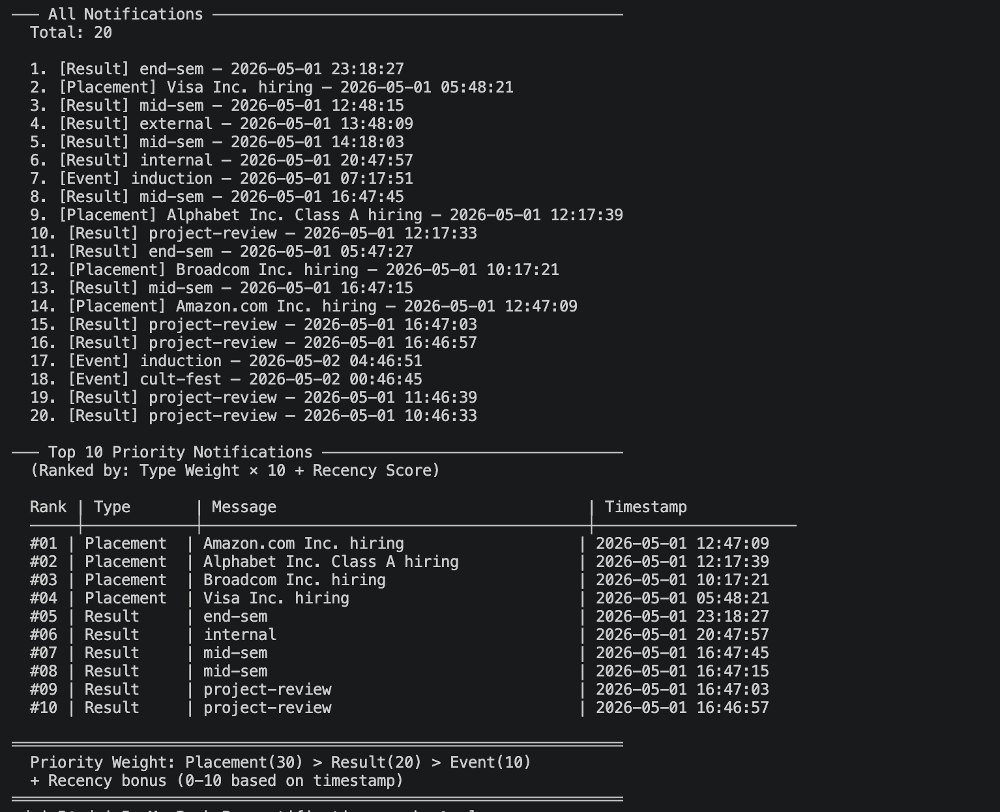
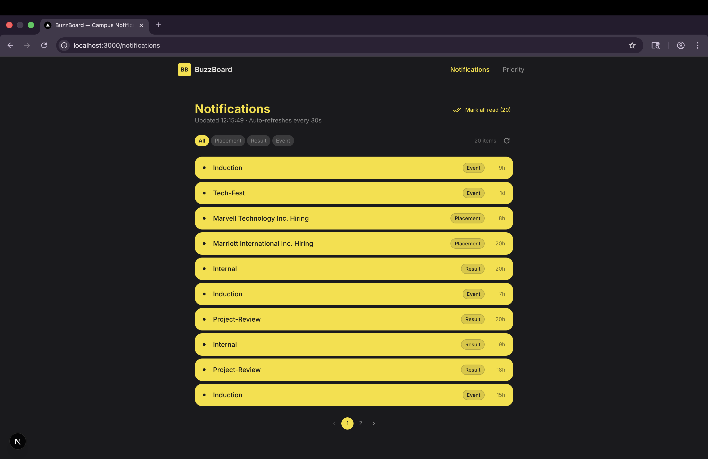
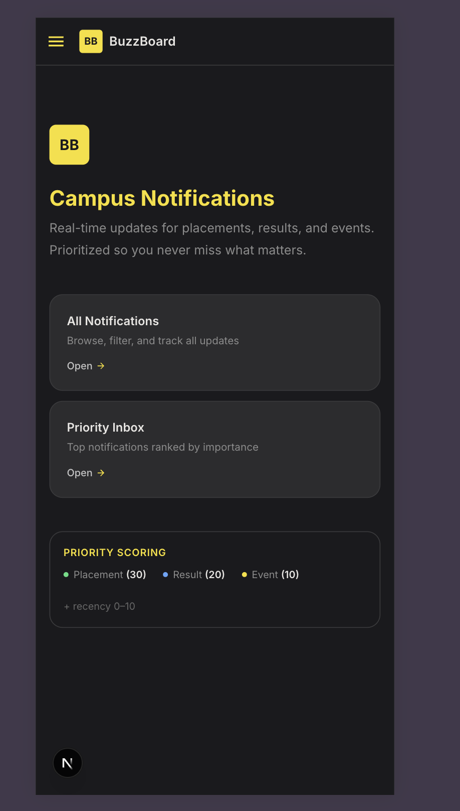

# BuzzBoard — Campus Notification Platform

A real-time campus notification system that fetches, prioritizes, and displays placement, result, and event notifications.

## Project Structure

```
├── logging_middleware/     # Reusable logging package
├── notification_app_be/    # Stage 1 — Priority Inbox (backend)
├── notification_app_fe/    # Stage 2 — React/Next.js frontend
└── notification_system_design.md
```

## Stage 1 — Priority Inbox

Fetches notifications from the API and ranks the top 10 using a min-heap based priority algorithm.

**Priority formula:** `score = (typeWeight × 10) + recencyScore`

| Type | Weight |
|------|--------|
| Placement | 30 |
| Result | 20 |
| Event | 10 |

Recency is normalized to 0–10 based on timestamp range.

**Run:**
```bash
cd notification_app_be
npm install
npm run dev
```

## Stage 2 — Frontend

Next.js app with Material UI. Features:
- All notifications with filtering and pagination
- Priority inbox with top-N selector
- Read/unread tracking (localStorage)
- Auto-refresh every 30 seconds
- Responsive design (desktop + mobile)

**Run:**
```bash
cd notification_app_fe
npm install
npm run dev
```
Opens at http://localhost:3000

## Logging Middleware

Reusable package that sends structured logs to the evaluation server. Validates stack, level, and package params at runtime. Used across both backend and frontend.

## Screenshots

### Stage 1 — Terminal Output


### Stage 2 — Desktop


### Stage 2 — Mobile


## Tech Stack

- TypeScript
- Next.js 16
- Material UI 9
- Min-Heap (priority queue)
